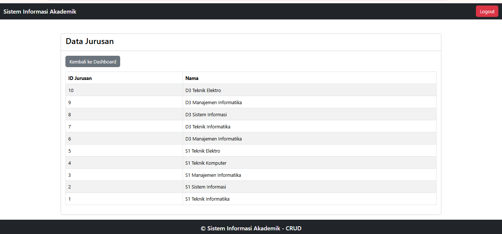

# 📚 Sistem Informasi Akademik (SIAKAD) - PHP Native

Project ini adalah sistem CRUD sederhana untuk data mahasiswa menggunakan PHP Native dan MySQL.

## ✨ Fitur
- Login & Logout
- CRUD Data Mahasiswa
- CRUD Jurusan
- Upload File
- Export PDF (dompdf)

Demo    : https://siakad.gc.tc
Download: https://bit.ly/4bSnD7L

## 🖼️ Tampilan Aplikasi

### 🔐 Login

### 🔐 Register

### 📊 Dashboard

### 📁 Data Dosen

### 📁 Data Jurusan

## ⚠️ Catatan
Source code utama tidak ditampilkan pada repository ini.  

## 🚀 Teknologi
- PHP Native
- MySQL
- Bootstrap
- Dompdf
